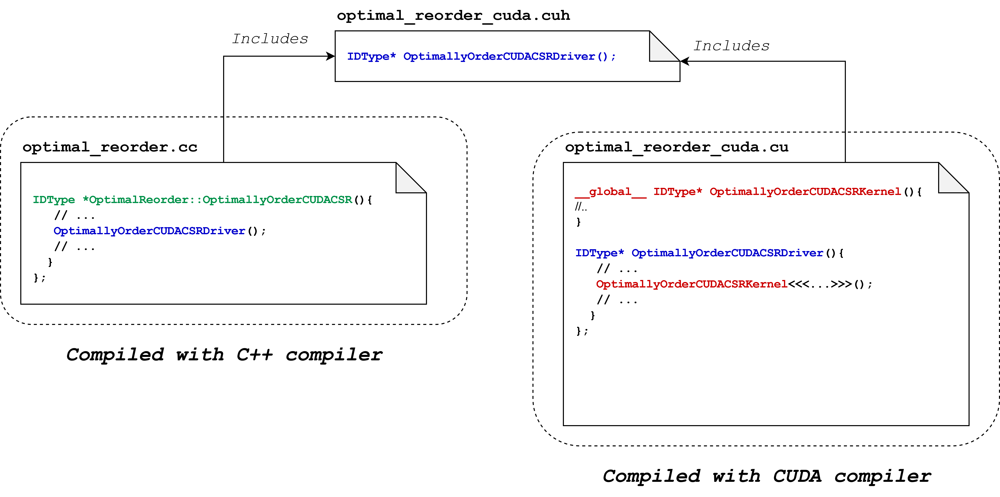

# How to: add a new reordering algorithm

## Objective
This guide demonstrates how to add a new reordering algorithm to the library.
## Overview

Adding new reordering algorithms to SparseBase is very simple. It consists of five steps:

1. Create a class for your ordering. 
2. Create a struct that will contain the hyperparameters needed by your ordering. 
3. Add implementation functions that will carry out the reordering. 
4. Add a constructor to your reordering class.
5. Add explicit template instantiations for your class.

## Steps

In this guide, we will create a new reordering `OptimalReorder`. This reordering has the following properties:

- It requires two floating number hyperparameters for execution, `alpha` and `beta`.
- It has two implementations. One that operates on a `CSR` format, and another that operates on a `CUDACSR` format, i.e., a `CSR` that is stored on a `CUDA` GPU.

### 1. Create a new class for the ordering

In the header file `src/sparsebase/preprocess/preprocess.h`, add the definition of your class. You should add your class under the namespace `sparsebase::preprocess`. It must be templated on three types `IDType`, `NNZType`, and `ValueType` which define the data types of the `Format` objects it will reorder. Also, it must inherit from the class `ReorderPreprocessType<IDType>` which defines the common API of all reordering classes.


```cpp
// File: src/sparsebase/preprocess/preprocess.h
namespace sparsebase::preprocess {
template <typename IDType, typename NNZType, typename ValueType>
class OptimalReorder : ReorderPreprocessType<IDType> {};
} // namespace sparsebase::preprocess
```

### 2. Create a struct containing the hyperparameters you need, and initialize them in the constructor

In the same file you defined `OptimalReorder` inside, create a new struct inheriting from `Parameters`. Its members will be whichever hyperparameters your reordering will require. We will call this struct `OptimalReorderParams`. We add `alpha` and `beta` to it. You may also add custom constructors for your parameter struct.

```cpp
// File: src/sparsebase/preprocess/preprocess.h
namespace sparsebase::preprocess {
struct OptimalReorderParams : Parameters {
    float alpha;
    float beta;
    OptimalReorderParams(float a, float b): alpha(a), beta(b){}
}
} // namespace sparsebase::preprocess
```
Note: you still need to create such a struct even if your reordering class does not require any hyperparameters. However, you may leave it as an empty struct.

Additionally, create a `typedef` for your struct as `ParamsType` inside the reordering class you created. This is needed by the `Reorder` function in `ReorderBase`, which is the interface most users will be using to access reordering classes.

```cpp
// File: src/sparsebase/preprocess/preprocess.h
namespace sparsebase::preprocess {
template <typename IDType, typename NNZType, typename ValueType>
class OptimalReorder : ReorderPreprocessType<ValueType> {
    typedef OptimalReorderParams ParamsType;
};
} // namespace sparsebase::preprocess
```

### 3. Add implementation functions

Add to the class the implementation functions that will carry out the reordering. Each function will be specific for an input `Format` format type. These functions should match the following signature:

```cpp
static IDType* FunctionName(std::vector<format::Format*>, Parameters*) 
```
The functions must also be *static*. This is required to enable the mechanism of choosing the correct implementation function for the input `Format`'s format type.  

The parameters that your function will take are:

1. A vector of pointers at `Format` objects.
2. A pointer at a `Parameters` struct. This pointer is polymorphic, and when this function is called, it will be pointing at an instance of the parameters struct created for your ordering. In our case, that would be an `OptimalReorderParams` object. 

Generally, all implementation functions will start with the same three steps:
1. Cast the input `Format` objects to the correct concrete type.
2. Cast the input `Parameters` to the params struct created for this class.
3. Fetch the `Context` of the input `Format` object (this step is not needed for reordering on the CPU, but is necessary when using other architectures, e.g. `CUDA`).

For our example, `OptimalReorder` will have two implementation functions, `OptimallyOrderCSR()` and `OptimallyOrderCUDACSR()`. The former will reorder `CSR` objects on the CPU, and the latter will reorder `CUDACSR` objects, i.e., `CSR` objects stored on a `CUDA` GPU. 

#### 3.1 Adding CPU function implementations
You must add the function according to the aforementioned signature and follow the steps mentioned above, namely casting the format and param objects, and fetching the context of the input.
```cpp
// File: src/sparsebase/preprocess/preprocess.h
namespace sparsebase::preprocess {
template <typename IDType, typename NNZType, typename ValueType>
class OptimalReorder : ReorderPreprocessType<ValueType> {
  //.......
  static IDType *OptimallyOrderCSR(
      std::vector<format::Format*> input_sf,
      Parameters *poly_params) {
    auto csr = input_sf[0]->AsAbsolute<format::CSR<IDType, NNZType, ValueType>>();
    OptimalReorderParams *params =
        static_cast<OptimalReorderParams *>(poly_params);
    context::CPUContext *cpu_context =
        static_cast<context::CPUContext *>(csr->get_context());
    // ... carry out the ordering logic
    return order;
  }
};
} // namespace sparsebase::preprocess
```

#### 3.b Adding `CUDA` GPU function implementations
Adding the implementation for `OptimallyOrderCUDACSR()` follows the same process as `OptimallyReorderCSR()` except for a major difference: it will use a `CUDA` kernel during its execution. This poses a problem since `CUDA` kernels need to be compiled by `nvcc`, not by a pure C++ compiler. The solution to this issue is to add `CUDA` kernels to a separate `.cu` file, and to use driver functions to interface with them. The kernel and driver functions will be compiled using `nvcc`, but the driver function's signature will not have any `CUDA` special syntax and will be included in the non-`CUDA` file. This way, the pure `C++` code can make calls to the driver function, and the driver function will be able to call the GPU kernel since it is compiled with `nvcc`. The process for `OptimalReorder` is shown in the following image:

In the `CUDA` file `cuda/preprocess.cu`, we define the GPU kernel `OptimallyOrderCUDACSRKernel()` (shown in red) and the driver function `OptimallyOrderCUDACSRDriver()` (shown in blue). We add the signature of the driver function to a header file `cuda/preprocess.cuh`. Now, in the pure `C++` file, `preprocess.cc`, we include the header file `cuda/preprocess.cuh`. This way we can call it inside the implementation function `OptimallyOrderCUDACSR()` (shown in green).

Note that `CUDA` functions related to reordering and preprocessing in general should be added to the file `src/preprocess/cuda/preprocess.cc`. 

Let's add these functions to our code. Add the `CUDA` kernel `OptimallyOrderCUDACSRKernel()` to the file `src/preprocess/cuda/preprocess.cu` under the namespace `sparsebase::preprocess::cuda`. This function carries out the reordering on the GPU. Next, add the driver function `OptimallyOrderCUDACSRDriver()` that dispatches this kernel under the same namespace.

```cpp
// File: src/sparsebase/preprocess/cuda/preprocess.cc
namespace sparsebase::preprocess::cuda {
template <typename IDType, typename NNZType>
__global__ void OptimallyOrderCUDACSRKernel(IDType *order, IDType *row_ptr,
                                           NNZType *col, IDType n) {
  // ... carry out ordering
}

template <typename IDType, typename NNZType, typename ValueType>
IDType *
OptimallyOrderCUDACSRDriver(format::CSR<IDType, NNZType, ValueType> *csr,
                               context::CUDAContext context) {
  // set up context and get pointers from format
  OptimallyOrderCUDACSRKernel<<<...>>>(...);
  // fetch output from GPU
  return order;
}
} // namespace sparsebase::preprocess::cuda
```

Add the signature of the driver function to the file `src/preprocess/cuda/preprocess.cuh` in order for the implementation function to be able to use it.

```cpp
// File: src/sparsebase/preprocess/cuda/preprocess.cuh
namespace sparsebase::preprocess::cuda {
template <typename IDType, typename NNZType, typename ValueType>
IDType *
OptimallyOrderCUDACSRDriver(format::CUDACSR<IDType, NNZType, ValueType> *csr,
                               context::CUDAContext context);
}
```


Finally, add the function `OptimallyReorderCUDACSR()` as an implementation inside the `OptimalReorder` class. Note that the function is enclosed in an `#ifdef USE_CUDA` preprocessor block. This will guarantee that it does not get compiled unless compilation of the library with `CUDA` is enabled.

```cpp
// File: src/sparsebase/preprocess/preprocess.h
namespace sparsebase::preprocess {
template <typename IDType, typename NNZType, typename ValueType>
class OptimalReorder : ReorderPreprocessType<ValueType> {
// We do not want the function to be compiled if CUDA isn't enabled
#ifdef USE_CUDA
  static IDType *OptimallyOrderCUDACSR(
      std::vector<format::Format*> input_sf,
      Parameters *poly_params) {
    auto cuda_csr =
        input_sf[0]->AsAbsolute<format::CUDACSR<IDType, NNZType, ValueType>>();
    OptimalReorderParams *params =
        static_cast<OptimalReorderParams *>(poly_params);
    context::CPUContext *cuda_context =
        static_cast<context::CUDAContext *>(cuda_csr->get_context());
    // ...
    // use the driver to call the CUDA kernel
    order = OptimalOrderCSRonCUDAGPUDriver(cuda_csr, *cuda_context);
    // ...
    return order;
  }
#endif
  // .......
};
} // namespace sparsebase::preprocess
```

### 4. Create a constructor for your reordering class
The constructor of a reordering class (and, in general, of any preprocessing class) does two things:

1. set the hyperparameters of class instance created,
2. register implementation functions to the right format types. 

Reordering classes can have as many constructors as the developer needs. However, at least one of them is required to have the following signature:
```c++
PreprocessingClass(PreprocessingClassParams);
```
Where `PreprocessingClassParams` is the struct representing the hyperparameters of the reordering (the one we created in step 2).

So, for our `OptimalReordering` class, you will create the following constructor:

```cpp
// File: src/sparsebase/preprocess/preprocess.h
namespace sparsebase::preprocess {
template <typename IDType, typename NNZType, typename ValueType>
class OptimalReorder : ReorderPreprocessType<IDType> {
    OptimalReorder(OptimalReorderParams params){
        
    }
};
} // namespace sparsebase::preprocess
```

Now, let's populate this constructor.

#### 4.1 Set the hyperparameters of instances of the class

Inside the constructor of the class, take the hyperparameters argument from the user and set the data member `params_`, which the class inherited from `ReorderPreprocessType`, to the newly added struct by copying the argument passed in the constructor.

```cpp
// File: src/sparsebase/preprocess/preprocess.h
namespace sparsebase::preprocess {
template <typename IDType, typename NNZType, typename ValueType>
class OptimalReorder : ReorderPreprocessType<ValueType> {
  // ...
  OptimalReorder(OptimalReorderParams params) {
    this->params_ =
        make_unique<OptimalReorderParams>(params);
  }
  // ...
};
} // namespace sparsebase::preprocess
```

#### 4.2 Register the implementations you wrote to the correct formats

Inside the constructor, register the implementation functions you made in step 3 to the `Format` type they are made for. This is how the library will be able to associate implementation functions with format types. 

Note that registering the `CUDACSR` implementation function is surrounded by an `#ifdef USE_CUDA` block to prevent it from being registered if the library is not compiled with `CUDA` enabled.

```cpp
// File: src/sparsebase/preprocess/preprocess.h
namespace sparsebase::preprocess {
template <typename IDType, typename NNZType, typename ValueType>
class OptimalReorder : ReorderPreprocessType<IDType, NNZType, ValueType> {
  // ...
  OptimalReorder(float alpha, float beta) {
    // ...
    this->RegisterFunction(
        {format::CSR<IDType, NNZType, ValueType>::get_id_static()},
        OptimallyOrderCSR);
#ifdef USE_CUDA
    this->RegisterFunction(
        {format::CUDACSR<IDType, NNZType, ValueType>::get_id_static()},
        OptimallyOrderCUDACSR);
#endif
    // ...
  }
  // ...
};
} // namespace sparsebase::preprocess
```

### 5. Add explicit template instantiations

The functions we have defined so far (except for the `CUDA` kernel and driver functions) have been defined in header files. This means that they will be compiled as they become needed by the user's code, and not at library build-time. However, the library supports a compiled version in which classes are pre-compiled using certain data types that the user selects. To add your class to the list of pre-compilable classes, you must do the following:

1. Move all the implementations from the header file (`src/sparsebase/preprocess/preprocess.h`) to the implementation file (`src/sparsebase/preprocess/preprocess.cc`).
2. Add your class to the list of classes that will be explicitly instantiated by the python script `src/generate_explicit_instantiations.py`.

Step two is much simpler than it sounds. At the end of the script `src/generage_explicit_instantiations.py`, add a single function call containing the `OptimalReorder` class definition and the name of the file to which we the instantiations are to be printed. In the case of `OptimalReorder`, add the following line to the end of the file:


```python
gen_inst("class OptimalReorder<$id_type, $nnz_type, $value_type>", "preprocess.inc")
```
The first parameter is the class declaration. The three variables beginning with `$` in the declaration above are placeholders that will be filled with the `IDType`, `NNZType`, and `ValueType` data types the user selects when compiling the library. If a user compiles the library with three `IDType` data types, two `NNZType` data types, and two `ValueType` data types, then the class will be compiled with 3 \* 2 \* 2 = 12 different type combinations.

The second parameter is the name of the file to which these instantiations will be printed, and it matches the name of the header file in which the class is defined.
## Results

Now, you can easily use your reordering as shown in the following example:

```c++
#include "sparsebase/preprocess/preprocess.h"
using namespace std;
{
    float alpha = 1.0, beta = 0.5;
    OptimalReorderParams params(alpha, beta);
    unsigned int * order = ReorderBase::Reorder<OptimalReorder>
            (params, some_format_object, {&cpu}, true);
}
```
Or, you could create the parameters object and make the call to `Reorder` in one line by utilizing bracket initialization:
```cpp
#include "sparsebase/preprocess/preprocess.h"
using namespace std;
{
    float alpha = 1.0, beta = 0.5;
    unsigned int * order = ReorderBase::Reorder<OptimalReorder>
            ({alpha, beta}, some_format_object, {&cpu}, true);
}
```

Alternatively, you can use the class directly as shown:

```cpp
#include "sparsebase/preprocess/preprocess.h"

float alpha = 1.0, beta = 0.5;
sparsebase::preprocess::OptimalReorder<int, int, int>
    reorder(alpha, beta);
int *order = reorder.GetOrder(some_format_object, {&cpu}, true);
```

In all the previous examples, if the format type of `some_sparseformat_object` is `CSR`, `CUDACSR`, or any other format that is convertible to either of the two aforementioned formats, then an order will be calculated for it.