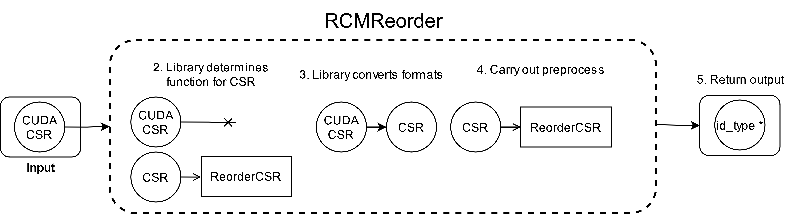

# Accelerating SpMV on the GPU using reordering

## Objective
Move matrices and vectors between the CPU and GPU and reorder a matrix to accelerate SpMV.

## Overview

In this tutorial, you will use SparseBase to do the following:

1. Read a matrix from a matrix market file into a SparseBase `CSR`.
2. Create a SparseBase `Array` from raw C++ data.
3. Move data to the GPU and use it in an SpMV operation.
4. Generate Gray code reordering of a matrix and use it to permute the matrix and an array.
5. Generate RCM reordering of a matrix by utilizing automatic function matching and conversion. 
6. Inverse the order of the result array.
7. Compile and run the code.

## Preliminaries
Start by navigating to the directory `tutorials/004_cuda_spmv/start_here/`. Open the file `tutorial_004.cu` using a code editor and follow along with the tutorial. 

The file contains some boilerplate code that includes the appropriate headers, creates some type definitions, and uses the `sparsebase` namespace. It also includes the `CUDA` kernel `spmv_1w1r` which carries out sparse matrix-vector multiplication. It takes the sparse matrix operand as a Compressed Sparse Row (CSR) matrix, and the vector operand as a dense array, and writes the multiplication result in a dense array.

The completed tutorial code can be found in `tutorials/004_reordering/solved/solved.cu`. 

To demonstrate our code, we will use a matrix from the [SuiteSparse](http://sparse.tamu.edu) matrix collection. In this example, we use the `POLYFLOW/mixtank_new` matrix, however, any symmetric matrix can be used as well. This code sample works with the matrix market file format. You can get this file from the following [link](https://sparse.tamu.edu/POLYFLOW/mixtank_new).

## Steps

### 1. Read a matrix and a vector from matrix market files.
Begin your main program by reading the sparse matrix operand from a matrix market file into a `CSR` object using the `ReadMTXToCSR` function in `IOBase`. 

```c++
// The name of the matrix market file in disk
std::string matrix_filename(argv[1]);
// Read the edge list file into a CSR object
CSR<id_type, nnz_type, value_type>* csr = IOBase::ReadMTXToCSR<id_type, nnz_type, value_type>(matrix_filename);
```

The three templated type parameters of the `CSR` and `ReadMTXToCSR` objects determine the data types that will store the number of rows and columns in the matrix, the number of non-zeros, and the values of the data in the matrix, respectively. These types are defined at the beginning of the file. You will find that these three template types are used by most classes of the library.

To get a feel for the data you just read, print some of its properties.

```c++
// get_dimensions() returns a vector with the dimension of
// each order of the format object
id_type num_rows = csr->get_dimensions()[0];
id_type num_columns = csr->get_dimensions()[1];
nnz_type num_non_zeros = csr->get_num_nnz();

std::cout << "Matrix has "
          << num_rows << " rows, "
          << num_columns << " columns, and "
          << num_non_zeros << " non-zeros" << std::endl;
```

### 2. Create a SparseBase `Array` from raw C++ data.
The matrix we just read needs to be multiplied by a vector, and you will generate this vector.
```c++
// Raw C++ array that will contain the data
value_type * vec_ptr = new value_type[num_columns];
// Fill the vector with random values
filL_randomly(vec_ptr, num_columns);
// Create a SparseBase Array as a wrapper around the raw array `vec_ptr`.
Array<value_type>* vec = new Array<value_type>(num_columns, vec_ptr, kOwned);
// We can access metadata of the Array
std::cout << "Vector has "
          << vec->get_dimensions()[0] << " elements " <<  std::endl;
```
Placing raw data in a SparseBase format object allows you to leverage the library's conversion, preprocessing, feature extraction, and I/O capabilities with this data.

The last parameter in the `Array` constructor, `kOwned` tells the object that it owns the data it wraps; once `vec` is deleted, the array `vec_ptr` will also be deleted. 

> Alternatively, we could have read the vector that is downloaded with the matrix from SuiteSparse as a second parameter.
 > ```c++
 > // The name of the matrix market file in disk
 > std::string vector_filename(argv[2]);
 > // Read the matrix market file into an Array object
 > Array<value_type>* vec = IOBase::ReadArrayFromMTX<id_type, nnz_type, value_type> (vector_filename);
 > ```

3. Move data to the GPU and use it in an SpMV operation.

Moving data between GPU the CPU is easy with SparseBase. Simply convert the formats you have into their `CUDA` counterparts.
```c++
  // Context representing the GPU with ID 0 in the system
  context::CUDAContext gpu0{0};

  // The conversion target is passed as a template parameter,
  // and the context to convert it to is the parameter.
  cuda::CUDACSR<id_type, nnz_type, value_type>* cuda_csr = csr->Convert<cuda::CUDACSR>(&gpu0);
  cuda::CUDAArray<value_type>* cuda_array = vec->Convert<cuda::CUDAArray>(&gpu0);
```

These `CUDA` format objects contain pointers at raw data on the GPU. Users can get and use this data in their own workflows. Note that the metadata of `CUDA` formats (order of the format, its dimensions, its number of non-zeros, and its context information) reside on the CPU. 

In addition to the operands, you also need to allocate memory to store the result calculated on the GPU. 

```c++
value_type * result_ptr;
// Allocate the memory using the native CUDA call
cudaMalloc(&result_ptr, num_rows * sizeof(value_type));
```

Now, fetch the raw pointers inside the `CUDA` formats and use them in a call to the SpMV kernel.

```c++
// These pointers point at data on the GPU
nnz_type* matrix_row_ptr = cuda_csr->get_row_ptr();
id_type* matrix_col = cuda_csr->get_col();
value_type* matrix_vals = cuda_csr->get_vals();

value_type* vector_vals = cuda_array->get_vals();

auto start = std::chrono::system_clock::now();
spmv_1w1r<<<NUM_BLOCKS, THREADS_PER_BLOCK>>>(matrix_row_ptr, matrix_col, matrix_vals, vector_vals, result_ptr, num_rows);
cudaDeviceSynchronize();
if (!cudaPeekAtLastError() == cudaSuccess){
    std::cout << "Kernel failed: " << cudaGetErrorString(cudaPeekAtLastError()) << std::endl;
    return 1;
}
auto end = std::chrono::system_clock::now();
std::chrono::duration<double> total_time = end-start;
std::cout << "SpMV without reordering takes: " << total_time.count() << " seconds" << std::endl;
```

### 4. Generate Gray code reordering of a matrix and use it to permute the matrix and an array.

Now, we will try the Gray code reordering algorithm on our matrix to see if it will accelerate our SpMV. Start by finding the reordering vector. 

```c++
// A context representing the host system
context::CPUContext cpu;
// Create a parameters object to store special parameters specific
// Gray reordering
GrayReorderParams gray_params(BitMapSize::BitSize32, 32, 32);
// Create an inverse permutation array  of the matrix `csr`
id_type * gray_reorder = ReorderBase::Reorder<GrayReorder>(gray_params, csr, {&cpu}, true);
```
We specify the reordering algorithm used by the `Reorder` function by passing its class as a template argument. 

The first parameter to the function is the parameter struct of the selected reordering algorithm. For context, each reordering algorithm (and preprocessing in general) has its own associated parameters struct that contains hyperparameters specific to it. 

The last two parameters are related to the function matching mechanism in SparseBase, which we will show an example of in the next step. Just know that they control whether the input format can be converted if needed. 

The output array `gray_reorder` is an array containing the _inverse permutation_ of all the rows/columns of `csr`. In other words, `gray_reorder[i] = j` indicates that the row `i` in `csr` is at location `j` after reordering.

Next, we must permute `csr` and `vec` according to this new order.

```c++
// `Permute2D` returns a CSR object but stores it in a polymorphic
// pointer at the superclass for two-dimensional formats, FormatOrderTwo.
FormatOrderTwo<id_type, nnz_type, value_type>* gray_reordered_csr = ReorderBase::Permute2D(gray_reorder, csr, {&cpu}, true);
// We move the reordered CSR to the GPU.
cuda::CUDACSR<id_type, nnz_type, value_type>* cuda_gray_reordered_csr = gray_reordered_csr ->Convert<cuda::CUDACSR>(&gpu0);
// Rather than get the generic pointer to `FormatOrderOne`, we can cast the output
// to the correct type in the same call to `Permute1D`
Array<value_type>* gray_reordered_vec = ReorderBase::Permute1D<Array>(gray_reorder, vec, {&cpu}, true);
// We move this array to the GPU.
cuda::CUDAArray<value_type>* cuda_gray_reordered_vec = gray_reordered_vec->Convert<cuda::CUDAArray>(&gpu0);
```

The `Permute2D` call returns a `CSR` object, but it returns it as a polymorphic pointer to the superclass `FormatOrderTwo` which is the parent of `CSR` and other order-2 formats. We can directly copy the returned `CSR` to the GPU through this polymorphic pointer.

Similar to `Permute2D`, `Permute1D` also returns a polymorphic pointer at the superclass `FormatOrderOne` (parent of `Array` and `CUDAArray`). However, if we know the data type of the returned object, we can cast the returned pointer to that type by passing it as a template argument to the function. Note that, if the cast fails, an exception will be thrown.

Let's try multiplication using the reordered data.
```c++
start = std::chrono::system_clock::now();
spmv_1w1r<<<NUM_BLOCKS, THREADS_PER_BLOCK>>>(cuda_gray_reordered_csr ->get_row_ptr(),
                                       cuda_gray_reordered_csr->get_col(),
                                       cuda_gray_reordered_csr->get_vals(),
                                       cuda_gray_reordered_vec->get_vals(),
                                       result_ptr, num_rows);
cudaDeviceSynchronize();
if (!cudaPeekAtLastError() == cudaSuccess){
  std::cout << "Kernel failed: " << cudaGetErrorString(cudaPeekAtLastError()) << std::endl;
  return 1;
}
end = std::chrono::system_clock::now();
total_time = end-start;
std::cout << "SpMV with Gray reordering takes: " << total_time.count() << " seconds" << std::endl;
```

### 6. Generate RCM reordering of a matrix by utilizing automatic function matching and conversion. 
Now, let's try Reverse Cuthill McKee (RCM) reordering but this time, take advantage of the function matching capability in SparseBase.

```c++
// We can pass the CUDACSR and the function will automatically convert it to CSR (i.e. move it to CPU) for reordering
id_type* rcm_reorder = ReorderBase::Reorder<RCMReorder>({}, cuda_csr, {&cpu}, true);
```
Every preprocessing algorithm in the library (reordering, partitioning, feature extraction, etc.) can be implemented for many format types. In this case, `RCMReorder`is only implemented for the `CSR` type. However, when we set the `convert_input` parameter (last parameter) to `true` in the call, this will allow function matching to take place. 

Function matching takes the input formats to a preprocessing and the contexts the user passes to the function call, and, if the input format can't be used directly for the preprocessing (i.e., no function exists for the input's format type), it attempts to convert the input (using the passed contexts) to a format for which an implementation exists in the preprocessing. When the conversion context is different from input format's context, that entails copying data to the a different context.

In this case, the `CUDACSR` input cannot be reordered directly, so it is converted to a `CSR` (copied to CPU), and then that `CSR` object is used for reordering.

The procedure for `RCMReorder` is demonstrated in the following figure.

> Note: the intermediate `CSR` object used for the function is deleted after execution. However, the user can use the `Cached` version of the `Reorder` function to get the intermediate `CSR` along with the output.

The same function matching is available in every preprocess function in the library, including permutation functions. `Permute2D` only has an implementation for the `CSR` format type, and `Permute1D` is only implemented for `Array` format type. Therefore, passing `CUDA` formats to them will trigger function matching. Let's do just that.

```c++
// A list of available contexts
std::vector<context::Context*> contexts = {&cpu, &gpu0};
// We can apply the permutation to the CUDACSR directly, as well, but the returned
// object will be a CSR since permutation will run on a CSR rathar than a CUDACSR
auto rcm_reordered_csr = ReorderBase::Permute2D<CSR>(rcm_reorder, cuda_csr, contexts, true);
auto cuda_rcm_reordered_csr = rcm_reordered_csr->Convert<cuda::CUDACSR>(&gpu0);

auto rcm_reordered_vec = ReorderBase::Permute1D<Array>(rcm_reorder, cuda_array, contexts, true);
auto cuda_rcm_reordered_vec = rcm_reordered_vec->Convert<cuda::CUDAArray>(&gpu0);
```

Now, run the SpMV kernel with this new graph.

```c++
start = std::chrono::system_clock::now();
spmv_1w1r<<<NUM_BLOCKS, THREADS_PER_BLOCK>>>(cuda_rcm_reordered_csr->get_row_ptr(),
                                       cuda_rcm_reordered_csr->get_col(),
                                       cuda_rcm_reordered_csr->get_vals(),
                                       cuda_rcm_reordered_vec->get_vals(),
                                       result_ptr, num_rows);
cudaDeviceSynchronize();
if (!cudaPeekAtLastError() == cudaSuccess){
  std::cout << "Kernel failed: " << cudaGetErrorString(cudaPeekAtLastError()) << std::endl;
  return 1;
}
end = std::chrono::system_clock::now();
total_time = end-start;
std::cout << "SpMV with RCM reordering takes: " << total_time.count() << " seconds" << std::endl;
```

### 6. Inverse the order of the result array.

The last result calculated is the result of multiplying the input matrix and vector after they had been reordered according to the RCM reorder array `rcm_reorder`. In other words, the output vector is a permutation of the actual output array. We must reverse its permutation to match the order of the original input matrix and vector.

To do so, we will reverse the `rcm_reorder` permutation vector and use it to permute the result.
```c++
// `reverse_reorder` can be used to undo the permutation done using `rcm_reorder`
id_type * reverse_rcm_reorder = ReorderBase::InversePermutation(rcm_reorder, num_rows);
```
We place the result array located on the GPU in a `CUDAArray` to use it in the `Permute1D` call.
```c++
// We place the raw array in a CUDAArray to use Permute1D
cuda::CUDAArray<value_type> cuda_rcm_reordered_result(num_rows, result_ptr, gpu0, kOwned);
// Since `Permute1D` is only implemented for `Array`, function matching takes place
FormatOrderOne<value_type>* foo_result = ReorderBase::Permute1D(reverse_rcm_reorder, &cuda_rcm_reordered_result, contexts, true);
// Safely cast the pointer at the parent `FormatOrderOne` to a pointer at `Array`
Array<value_type>* arr_result = foo_result->As<Array>();
```
Since `Permute1D` is only implemented on `Array` format types, the call to `Permute1D` above will convert the `CUDACSR` input to an `Array`, permute it, and return an `Array` with the result.

### 7. Compile and run the code
While in the directory `tutorials/004_cuda_spmv/start_here`, download the matrix file and extract it:
```bash
wget https://suitesparse-collection-website.herokuapp.com/MM/POLYFLOW/mixtank_new.tar.gz
tar -xvf mixtank_new.tar.gz
```
Then, compile and execute the code with the following commands:
```bash
nvcc -std=c++17 tutorial_004.cu -lsparsebase -lgomp -std=c++17 -o spmv.out
./spmv.out mixtank_new/mixtank_new.mtx 
```

You should see output similar to the following, but with different timings:

```
Matrix has 29957 rows, 29957 columns, and 1995041 non-zeros
Vector has 29957 elements 
SpMV without reordering takes: 0.000158657 seconds
CSR column array must be sorted. Sorting...
SpMV with Gray reordering takes: 0.000170343 seconds
CSR column array must be sorted. Sorting...
SpMV with RCM reordering takes: 0.000148291 seconds
```