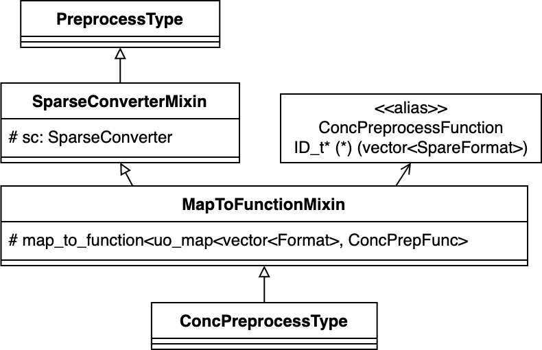
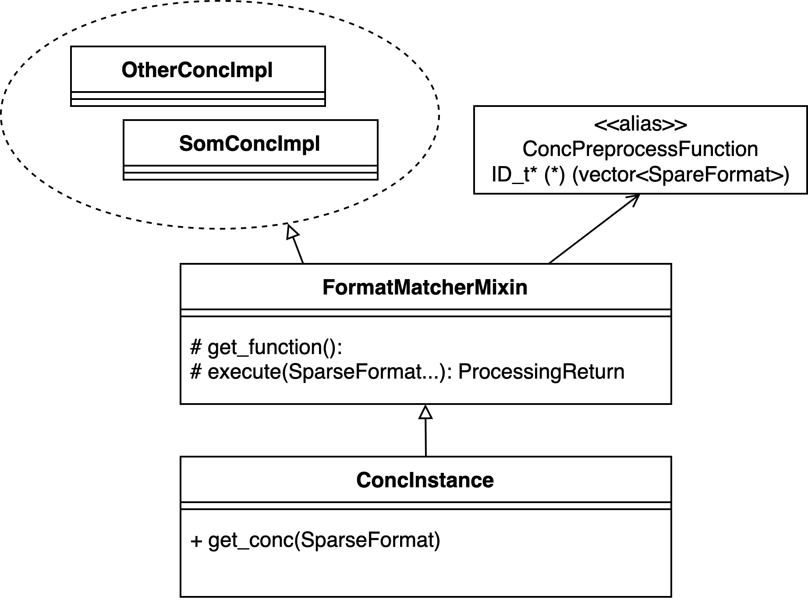
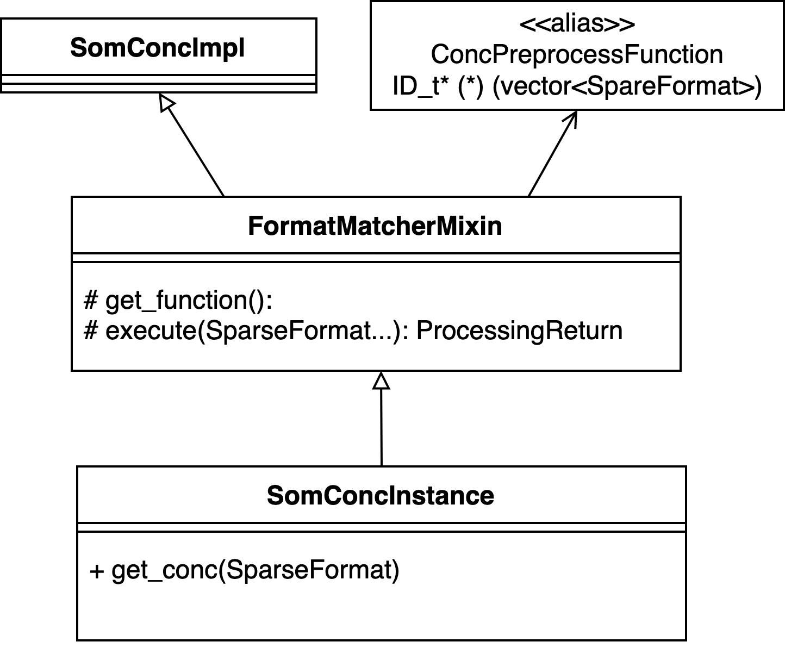

# SparsePreprocess Design

# Overview

A preprocessing instance provides one or more functions that take an input composed of one or more `SparseFormat` objects (and, optionally, other data structures) and produce an output data structure. The preprocess functions in a preprocess instance differ in the `Format` of the input `SparseFormat` that they target. A preprocessing instance is able to automatically check the input `SparseFormat`'s format, carry out needed conversions from one format to another (if needed and if possible), and carry out the appropriate function for that input. 

Preprocesses are organized into "types" (reordering, partitioning, etc.) which are defined by the signatures of the preprocessing functions they contain (input and output). Each type can have multiple "implementations" (degree ordering, METIS partitioning, etc.). There are two methods of creating preprocessing instances, a process type-wide method, and a preprocess implementation-specific method.

# Inner State

The state of a preprocess instance is exactly three things:

1. **Preprocess implementation-specific hyperparameters.** Each instance can have hyperparameters that it will use when carrying out preprocessing.
2. **Map of functions.** The mapping between `Format` and preprocess functions.
3. **Sparse Converter object.** an object that it will use to carry out conversions between sparse formats.

A preprocess *does not* persist any data from any of its invocations; a single preprocess instance can be used to process multiple inputs independently.

# Implementation

## Preprocess Types

We define classes for each preprocess type in the library. The manner in which we define these classes is explained below.

Logically, a preprocess type is defined by the signature of its preprocess functions. We use function pointers to represent these signatures. There is no class that encapsulates these function pointers. Instead, we use [C++ aliases](https://en.cppreference.com/w/cpp/language/type_alias) to refer to them. The alias of the preprocess function signature of some preprocess type is referred to as the `PreprocessFunction` of that type. For example, the `PreprocessFunction` of the preprocess type "Reorder", `ReorderFunction` is:

```cpp
using ReorderFunction = ID* (*)(std::vector<SparseFormat<ID, NumNonZeros>*>)
```

We refer to the inputs of a `PreprocessFunction` as `PreprocessInput...`, and to the output as `PreprocessOutput`. 

A preprocess type must also have a `SparseConverter` object to allow it to convert `SparseFormat` between formats. In addition, a preprocess type has the map from `vector<Format>` to instances of its `PreprocessFunction`. That is why we need the `PreprocessFunction`s to be addressable. We use specialization through mixins as a pattern to solve this issue. In this solution, there are three concrete components that take part in defining a single process type. 

1. A generic, empty `PreprocessType` class
2. A mixin `MapToFunctionMixin` templated over `PreprocessFunction`. It adds a map between vectors of `SparseFormat`s and `PreprocessFunction` function pointers and exposes some utility functions.
3. A mixin `SparseConverterMixin` that adds a `SparseConverter` and its functionalities.

For example, to define the preprocess type class for the preprocess type `Conc`, we define a concrete `PreprocessFunction` for it:

```bash
using ConcPreprocessFunction = ID* (*)(vector<SparseFormat>) 
```

Then, we define a class for it, which will combine the three components above, and specialize the `MapToFunction` mixin to the defined `ConcPrepFunction` in order for it to have the correct map.

```bash
class ConcPreprocessType : MapToFunction<SparseConverterMixin<PrepropcessType>, ConcPreprocessFunction>{};
```

The figure below shows the structure of `ConcPreprocessType`. Notice that `ConcPreprocessFunction` is used as a template argument, and is *not* being inherited.



`SparseConverterMixin` attaches its functionality to `PreprocessType`. `MapToFunctionMixin` attaches its functionality, which is specialized by the `PreprocessFunction` alias `ConcPreprocessFunction`, to the resulting class. The resulting class represents the `Conc` Process type

## Preprocess Implementations

A preprocess implementation is a class that inherits directly from a preprocess type. It contains the following three types of components:

1. **Implementation functions:** these are the bread and butter of the SparsePreprocess package objects. They are *static* functions that must follow the `ProcessFunction` signature of their process type.
2. **hyperparameters:** data members of the preprocess implementation class. They are any hyperparameters that will be needed for this process implementation. Hyperparameters are optional.
3. **Constructor:** the constructor must register all the implementation functions to the map between which maps `Formats` to functions, and sets the hyperparameters using constructor arguments.

Additionally, developers can add as many helper functions or data members as they need to their implementations.

**What if different implementation functions require different hyperparameters?**

To maintain the consistency of the library, we recommend that, if a specific implementation function requires a specific hyperparameter, that it be placed in a different class that inherits from the original implementation class. In this new class, the additional hyperparameters will be class members.

The following is a code example of a preprocess implementation belonging to the type `ConcProcType`

```cpp
class SomeConcImpl : public ConcPreprocessType{
   protected:
		 static ID* impl_for_csr(vector<SparseFormat>){
				// implementation
		}
		int _hyperparameter1;
	public:
		SomeConcImpl(int hp1): _hyperparameter1{
			this->register_function({CSR_f}, impl_for_csr);
			// This function comes from the MapToFunctionMixin
			// it informs the class that this function is for
			// an input composed of one SparseFormat; a CSR 
		}
};
```

## Preprocess Instances

Users can use preprocesses through preprocess instances. Instances use preprocess implementation classes and provide users with an interface as well as automated `SparseFormat` conversion. We incorporate automated conversion using the mixin pattern. We have a mixin, `PreprocessMatcherMixin`, which is templated by `PreprocessFunction`, that takes a vector of `SparseFormat` objects and a map from `SparseFormat` vectors to `PreprocessFunctions` and does the following:

1. Check to see whether the map has a function for a given vector of `SparseFormat` objects
    1. If it doesn't, find the correct conversion schema for the `SparseFormat`'s combination: what each `SparseFormat` in the input needs to be converted to
    2. Carry out the conversion of all the `SparseFormat`s by communicating with the `SparseConverter`
2. Return the correct function and the appropriate `SparseFormat`s (converted or not)

Preprocess instances must be combined with this mixin and must provide an accessible interface for the user. There are two types of preprocess instances. Type-wide and implementation-specific.

### Type-wide

A type-wide instance is a class that is specific for a certain preprocess type but is templated (generic) over all the *preprocess implementation* classes of that preprocess type. It receives a `ProcessImplementation` as a template, adds to it a `FormatMatcherMixin` that is templated by that preprocess type's `ProcessFunction`, and inherits the resulting class. The implementation of the instance class consists of public functions available to the user.

An important constraint on this interface is that it *must* access the underlying `ProcessImplementation` using the `FormatMatcherMixin` function `execute()`. The following figure shows the structure of a type-wide instance class `ConcInstance` that is specific for the preprocess type `ConcPrepType` (the specificity happens through `ConcPreprocessFunction`). Notice that it can be used with any `PreporocessImplementation` classes for this preprocess type.



The preprocess implementation that is inherited by `FormatMatcherMixin` is left as a template. This preprocess instance can be used as follows:

```cpp
ConcInstance<SomConcImpl> conc_inst1; // uses the implementation "SomConcImpl"
ConcInstance<OtherConcImpl> conc_inst2; // uses the implementation "otherConcImpl"
```

### Implementation-specific

An implementation-specific instance is a class that is specific for a preprocess implementation within a preprocess type. It is very similar to the type-wide instance class, except that it does not take the preprocess implementation as a template parameter. It provides the added benefit over type-wide instances of giving developers the ability to write specific functions for their implementation. However, it must be handwritten by the developers for a specific implementation. 

These interfaces are scoped to specific process implementations. They are similar to type-wide interfaces, except that they are not templated in terms of the `ProcessImplementation` that they `FormatMatcherMixin` inherits. Instead, they inherit directly from the process implementation they are meant for. The following figure shows the structure of the instance `SomConcInstance` which is specific for the implementation `SomConcImpl` of the preprocess type `ConcPrepType`.



Its usage is simple:

```cpp
SomConcInstance som_inst;
```